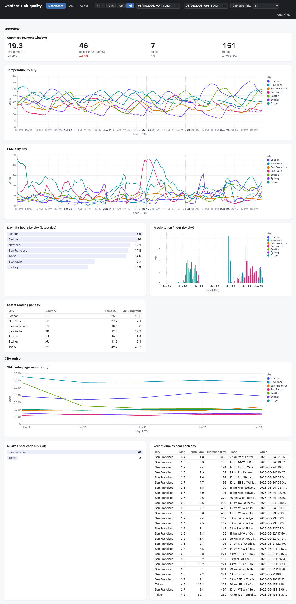

# duckpond

A local-DuckDB toolkit in two parts:

- **[ducktail](ducktail/)** -- ingest. Pull scattered sources into a local DuckDB warehouse with a
  small incremental harness; a skill plus a project template.
- **[duckbill](duckbill/)** -- dashboards. Serve and share that warehouse as a live, query-backed
  dashboard declared as Python data.

ducktail builds the warehouse, duckbill serves it. duckbill is general -- it works against any
DuckDB/SQLite store, ducktail-built or not.



## End-to-end example

[`examples/weather/`](examples/weather/) runs the whole pipeline over real, keyless
public data: ducktail ingests Open-Meteo weather + air quality and computes daylight
locally, joins them on city and hour, and duckbill dashboards it.

The ingest side is plain Python. A source is a table spec plus a `produce` that fetches only
what's new since the last run ([`sources/weather.py`](examples/weather/sources/weather.py)):

```python
WEATHER = Table("weather", "merge", ("city", "ts"), "ts",   # name, mode, key, cursor
                2 * 3600, initial(max_days=7))               # overlap, initial window

def produce(starts: dict[str, int]) -> Iterator[tuple[Table, Batch]]:
    since, now = starts["weather"], _http._now()             # resume from the high-water mark
    past_days = max(1, (now - since) // 86400 + 1)
    rows: list[dict[str, object]] = []
    for c in CITIES:                                         # fetch only what's new, per city
        url = _openmeteo.build_url(URL, c["lat"], c["lon"], HOURLY, past_days)
        rows.extend(_openmeteo.hourly_rows(c["city"], _http.fetch_json(url), FIELDS, since, now))
    yield WEATHER, rows

WEATHER_SOURCE = Source("weather", [WEATHER], produce)
```

`refresh.py` wires the sources, runs the load, and joins them post-load into the one table the
dashboard reads ([`examples/weather/refresh.py`](examples/weather/refresh.py)):

```python
SOURCES = [CITIES_SOURCE, WEATHER_SOURCE, AIR_SOURCE, DAYLIGHT_SOURCE]

def transforms(con: duckdb.DuckDBPyConnection) -> None:
    con.execute("""
        CREATE OR REPLACE TABLE warehouse.city_hourly AS
        SELECT w.ts, w.city, c.country, w.temp_c, w.precip_mm, w.wind_kph, a.pm2_5, a.ozone,
               d.day_length_s, (w.ts >= d.sunrise AND w.ts < d.sunset) AS is_daylight
        FROM warehouse.weather w
        LEFT JOIN warehouse.air_quality a USING (ts, city)
        LEFT JOIN warehouse.cities      c USING (city)
        LEFT JOIN warehouse.daylight    d ON d.city = w.city AND d.date = w.ts - w.ts % 86400
    """)

con = duckdb.connect("weather.duckdb")
run(con, SOURCES)        # incremental load -- each source resumes where it left off
transforms(con)          # then join, post-load
```

Each subdirectory is self-contained, with its own README, tests, and (for duckbill) packaging.
